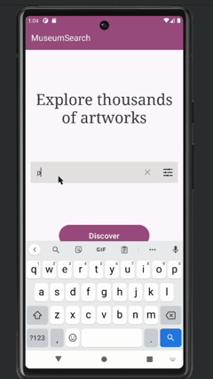
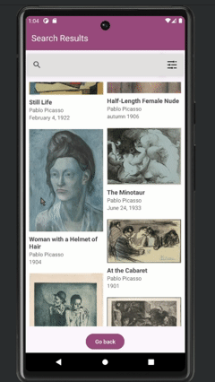
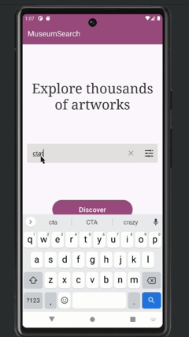
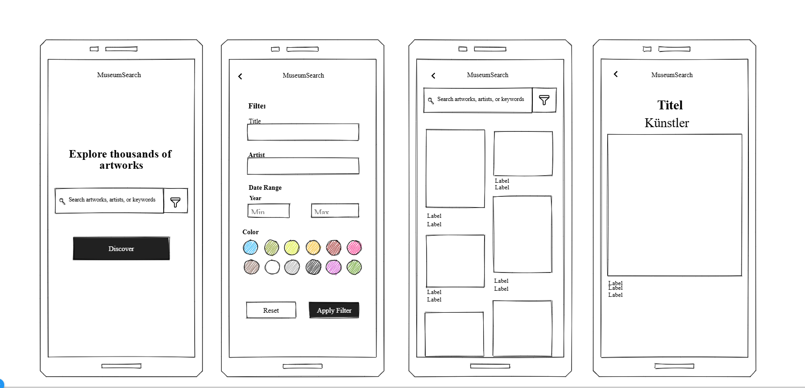

## Readme

### An Android app for searching artworks from the Art Institute of Chicago
#### 2025 university project. Focus: human Computer Interaction, UI and usability

  
  
  
  

#### A low fi mockup I made on [Mockflow](https://mockflow.com/) before building the app:

---

#### How to try it yourself: 1. Clone the repository. 2. Open the project in Android Studio. 3. Run it on an Android emulator or Android device. (Tested on a Pixel 6 with Android 30)

### Implementierung

Framework:	Android

API-Version:	Android 30

Gerät(e), auf dem(denen) getestet wurde:
Pixel 6 - API 30 

Externe Libraries und Frameworks:

'com.android.volley:volley:1.2.1'

'com.github.bumptech.glide:glide:4.16.0'

'com.github.chrisbanes:PhotoView:2.3.0'

Credits:
- University of Chicago api - https://api.artic.edu/docs/
- Zoom - Icon made by Radhe Icon from www.flaticon.com
- Welcome Header Spruch Inspo -  https://www.artic.edu

Tutorials:
- https://www.youtube.com/watch?v=4lEnLTqsnaw
- https://github.com/bumptech/glide
- https://www.geeksforgeeks.org/image-loading-caching-library-android-set-2/
- https://www.geeksforgeeks.org/volley-library-in-android/
- https://www.youtube.com/watch?v=tQ7V7iBg5zE&ab_channel=CodingSTUFF
- https://developer.android.com/reference/org/json/JSONObject
- https://developer.android.com/develop/ui/views/layout/recyclerview?hl=de
- https://developer.android.com/reference/androidx/recyclerview/widget/RecyclerView
- https://developer.android.com/reference/androidx/recyclerview/widget/RecyclerView.Adapter
- https://www.geeksforgeeks.org/recyclerview-as-staggered-grid-in-android-with-example/
- https://www.geeksforgeeks.org/android-recyclerview/
- https://www.willowtreeapps.com/craft/android-fundamentals-working-with-the-recyclerview-adapter-and-viewholder-pattern
